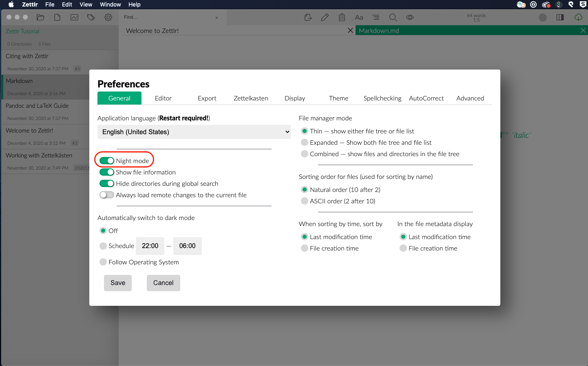

# Dracula Theme for Zettlr

This was a quick-and-dirty solution to add my favorite theme to Zettlr. I'm in the process of integrating the theme more fully with Zettlr, but hopefully this helps out my fellow Dracula fans in the meantime!

## What is This?

[Zettlr](https://www.zettlr.com/) is a free, open-source markdown editor specifically geared toward creating [Zettelkasten](https://zettelkasten.de/).

[Dracula](https://draculatheme.com/) is a free dark theme for a text editors, terminals, and various apps.

## How to Use
Here you go, 4 easy steps:

In Zettlr, open the settings dialog:

---

Turn on night mode:

---

If you like a monospace font, go to the __Theme__ tab and pick "Bordeaux":

---

Now, open the Custom CSS tool, and copy the contents of [zettlr-dracula-theme.css](zettlr-dracula-theme.css) and paste them into the Custom CSS window.

Enjoy!

## Contributing

If you've got an improvement, feel free to fork this repository and submit a pull request! Contact me with questions at aspen.hollyer@gmail.com. Cheers!